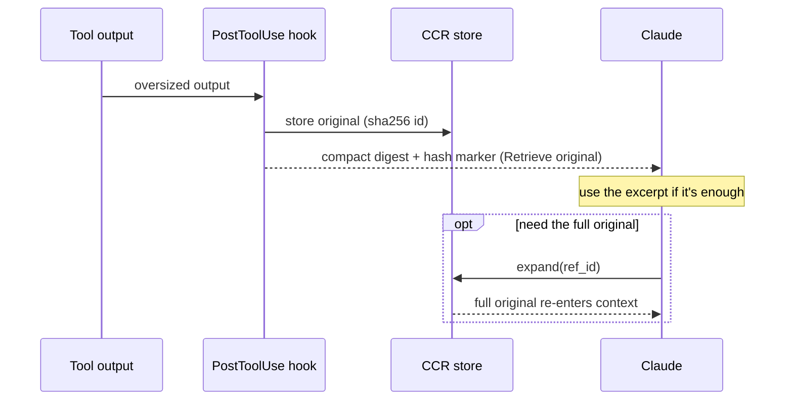

# Compression

Compression is one of Golem's pipeline stages, and its honest value is
**situational** (Decision 23): whether it saves tokens depends entirely on the
upstream, not on the dial setting.

- **Lossless compression** (dedup of repeated spans and whitespace compaction of
  tool results) runs from compression level 1. It is **lossless and
  prefix-stable**, not byte-faithful: the request body is re-serialized, a
  repeated span of 256+ characters is replaced by a
  `[Golem: duplicate content elided ... Retrieve original: hash=<id>]` marker
  (`src/compression/native-lossless.ts:121`, `:190-203`; threshold `:77`), and
  trailing whitespace and runs of blank lines in tool results are collapsed
  (`src/compression/compaction.ts:24-33`). The model sees a marker where the
  duplicate was, and the original is recoverable with `expand`. What the stage
  guarantees is that its output for a given conversation prefix is a pure
  function of that prefix, so the cached prefix stays byte-identical turn to
  turn. That is also all "cache-alignment" means here: a property of every
  transform (`native-lossless.ts:13-34`), not a separate stage. See
  [[Compression Levels]].
- **Lossy semantic compression** (stale-turn drop; the `aggressive` mode prunes harder) is added
  at levels 2–3. This is where real token savings come from — but **only on
  non-caching upstreams**, and only when the Headroom sidecar is enabled
  (`compression.headroom_sidecar`, default off). Level 2 needs the sidecar exactly
  as level 3 does: with it disabled, both degrade to level 1
  (`src/compression/effective-level.ts:115-124`). The level-2 status note in
  `src/cli/dials.ts:211-215` does not say so, unlike level 3's (`:219`); that is a
  code-side gap, not a difference in behaviour.
- **CCR swaps of tool output** are a separate mechanism and are **not governed by
  the compression dial**. See the CCR section below.

## Why the lossy stage is NET-NEGATIVE on Anthropic — measured, not assumed

Anthropic's prompt caching already amortizes a stable prefix across turns, so
rewriting that prefix (what semantic compression does) *breaks the cache* instead of
saving money. This was long described here as "~0% savings". **It is worse than
that**, and as of 2026-07-31 it is measured rather than asserted
(verification-notes §103, `scripts/measure_headroom_cache.py`):

- The lossy stage's **gross** reduction is real — **7.08%** on a 1,404-message
  session, **21.69%** on a 4,631-message one, growing with session length.
- But it first diverges from the original history at **message 6 of 4,631**, leaving
  **0.01%** of the history cache-readable. Headroom's `read_lifecycle` earns its
  savings by dropping the *earliest superseded* copy of a re-read file, so its value
  and its cache damage are the same act — not a tuning problem.
- Priced against this project's **98.4%** billed hit rate: **8.7×–11.3× more
  expensive** than not compressing. On a non-caching upstream the same runs save
  **9.06% / 30.09%**.

The takeaway for any future compressor: the number that decides it is
**first-divergence index**, not gross tokens. Something that rewrites only the
*tail* of history could pass where this fails. The stages that pay are gated to engage only on non-caching
upstreams, and the same pipeline is designed to extend to those gateways (Foundry,
OpenRouter — on hold per Decision 36). This is why the project positions itself as
a universal pre-LLM processor (Decision 32) with compression as *one* situational
lever, not the headline.

The lossless half is always worthwhile (it never breaks the cache); the lossy
half is the situational part. Implementation lives in `src/compression/`
(`native-lossless.ts` for the lossless path, which is off at
`compression.level: off` — `src/interfaces/policy.ts:142-148` — and
`headroom-adapter.ts` for the pinned Headroom semantic stage).

### Is everything lossy reversible?

No, and the earlier "everything lossy is reversible" was too broad. Reversal
covers the stages that store an original behind a `hash=` marker: the lossless
dedup above, context substitution
(`src/compression/context-substitution.ts:183-194`), and the markers Headroom
emits in `tool_result` / `role: "tool"` shapes, which the CCR bridge records
(`src/compression/headroom-ccr-bridge.ts:24-28`). A **stale-turn drop** by
Headroom leaves no marker and is **not recoverable**. The bridge also pairs
messages by index (`:126-131`), so after a drop it can misalign later pairs and
backfill nothing (it fails open). Treat the semantic stage as lossy and, for
dropped turns, unmarked.

### The Headroom config check

`golem status` flags a `compression.headroom_config` key as unreachable using a
**static** list (`KNOWN_HEADROOM_CONFIG_FIELDS`,
`src/compression/headroom-adapter.ts:529-539`, via `unreachableHeadroomConfigKeys`,
called at `src/cli/status-collect.ts:341` with no worker report). The list lacks
the `router` namespace that Decision 57 documents, so a correct
`router: {...}` override is reported as unreachable. The list's own comment says
that "warned wrongly" direction must not happen, so this is a **known bug**
(left to Phase 3). The worker's own `supported_config` is authoritative when a
worker is up; the static list is only the fallback.

## CCR reference lifecycle

**CCR** (content-reference) is the reversible half: an oversized tool output (or web
page, see [[Web Cache]]) is stored losslessly under `.golem/ccr` and replaced with a
compact digest carrying a `hash=<id>` marker. Nothing is lost — Claude re-hydrates
the original in one step with the `expand` MCP tool only when the excerpt isn't
enough. The swap is done by the PostToolUse hook, which never reads
`compression.level`: it **fires at `off` too**
(`src/hooks/post-tool-use.ts:264-325`, hook dispatch `src/cli/fast-path.ts:331-346`).
It transforms tool output on its way into Claude Code's context rather than
the proxied request. (Default rule applied, decision C3: document shipped
behaviour; whether `off` should stop it is not a recorded decision.) `.golem/ccr` is rooted per PROJECT, not per directory — see
[[CCR Ref Scope]] for how a git worktree resolves to its main checkout's root so
a ref survives across the two.

See also [[Compression Levels]], [[Redaction Stage]], [[Architecture]], and
[[Wiki-First Knowledge]].
