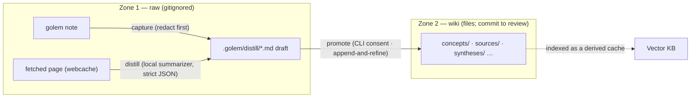

# Distillation Pipeline

The data flow for turning raw, low-friction capture into durable wiki knowledge
(spec Decision 20f, foundation for P2). Capture (T4), distill (T3, extended by R3.5 to
cover notes as well as fetched URLs) and promote (R4.5) are all built. Agent writes to
the wiki carry no prior-approval gate (Decisions 44 and 54); the `promote` CLI keeps
its own consent prompt.

## The loop, and the zones it crosses

Capture lands in **zone 1** (local, gitignored, never committed); distillation
shapes a draft; promote is the step that writes a **zone 2** wiki page committed to
git. The `promote` CLI asks for consent (TTY prompt, or `--yes`); an agent calling
`wiki_upsert` does not need prior approval. The zones are defined in the wiki schema (`WIKI.md`); see also
[[Wiki-First Knowledge]], [[Knowledge Base]], and [[Architecture]].

## Stage 1 — capture (built, T4)

`golem note "text"` is the fastest path into the pipeline: redact (reusing
`pipelineRedact` + `stripKnownSecrets`, `src/hooks/redact.ts` — same
never-weaken/never-reorder floor as every other storage path), then append a
`{ts, text}` line to `<project>/.golem/notes/notes.jsonl`. This is zone-1 raw
capture (local, gitignored, never committed — see [[Wiki-First Knowledge]]'s
zone table): instant and dependency-free, no inference on the capture path.
`golem note list` reads the same file back, newest first.

## Stage 2 — distill (built, T3)

`distillPage` (`src/knowledge/distill.ts`) calls the local `summarizer` role
with the page's already-redacted webcache text plus the wiki's current page
titles, forcing strict JSON output via `InferenceService`'s `jsonSchema`
option (the first real user of that frozen-contract field). It returns a
`DistillDraft`: title, kebab-cased slug, tags, a summary in the model's own
words citing the URL, and wikilinks — filtered down to only entries that
case-insensitively match a real existing title (canonical casing kept), so
the model can suggest links but never invent a page that doesn't exist. A
malformed or non-JSON response raises `DistillParseError` with the raw output
attached, rather than writing garbage.

Drafts land at `.golem/distill/<slug>.md` (`src/knowledge/distill-store.ts`)
— zone 1, gitignored, wiki-page-shaped from the start (`type: source`,
reusing the same `parseFrontmatter`/`serializeFrontmatter` the real wiki
pages use) so promoting one later is a copy into `sources/`, not a reformat.
Writing is keyed by the **model-chosen slug** (`draftPath(projectDir, draft.slug)`,
`distill-store.ts:61`; the slug comes from `parseDistillResponse`, `distill.ts:284`),
not by the URL. Re-distilling a URL with `--force` overwrites its prior draft only if
the model picks the same slug again; a different title leaves two drafts for one URL,
and two URLs that get the same slug overwrite each other (audit D11, open).

Entry points:

- `golem wiki distill <url>` — distill one cached page now. Prefers an
  existing draft for that URL over re-distilling (pass `--force` to
  override); fails with a clear message (not a crash) when the URL isn't
  cached yet or no local model is configured.
- `golem wiki distill --pending` — list drafts awaiting review.
- **Lazy backfill**: per Decision 29 ("backfill lazily, on next access"), the
  WebFetch pre-hook (`runWebFetchPre`, `src/hooks/web-fetch.ts`) checks for an
  existing draft whenever it serves a cached URL and appends a one-line
  pointer to its served content — never the draft body, and never triggers a
  distill itself. That lookup runs in its own inner `try`/`catch` so a bug in
  it can never regress the hook's existing (and more important) cache-serve
  behavior.
- The `/golem-wiki-ingest` skill runs `golem wiki distill <url>` as its first
  step, so Claude reviews/refines an existing draft instead of re-distilling
  from scratch.

### Note-shaping (built, R3.5)

`distillNote` (same file) is `distillPage`'s sibling for notes: it calls the
same `summarizer` role with a captured note's text plus the wiki's current
page titles, forcing strict JSON via the same `jsonSchema` mechanism — but
first asks the model to classify the note as `question` (something open or
unresolved worth investigating later) or `artifact` (a decision, snippet, or
design note worth keeping as-is), and the resulting `NoteDraft`'s `type`
frontmatter matches. Both flows share one JSON-parse/validate/kebab-case/
wikilink-canonicalize implementation (`parseDistillResponse`) — a note has no
source URL to cite, so its draft body omits the "Source:" line the URL flow
writes, and its `sources` frontmatter array holds a synthetic `note:<ts>`
provenance marker (the note's own capture timestamp) instead of a URL, keeping
draft lookup consistent with the existing `sources`-array pattern
(`findDraftByNoteTs` mirrors `findDraftByUrl`). Note-drafts land in the same
`.golem/distill/` directory as URL-drafts, so `golem wiki distill --pending`
already lists both kinds together with no changes needed.

Entry point: `golem note distill [ts]` — distill one captured note (the most
recent, or a specific one by its `ts`). Same "prefer an existing draft unless
`--force`" rule as `golem wiki distill`.

### Weekly synthesis (built, R3.4)

`synthesizeWeekly` (same file) draws a through-line over a whole period at
once rather than one capture at a time: it gathers the wiki's `debriefs/`
zone pages created in the last N days plus `golem note` captures from the
same window (`listNotesSince`, `src/cli/notes.ts`), and asks the `summarizer`
role for 1-3 recurring threads, reusable patterns, and open follow-ups — not
a list of what happened. Same JSON-forcing/parse-error/wikilink-
canonicalization contract as `distillPage`/`distillNote` (it reuses
`distillResultSchema` and `parseDistillResponse` directly, since a
`SynthesisDraft` is structurally identical to a `DistillDraft`). The draft's
`sources` frontmatter cites every debrief relPath and `note:<ts>` marker it
drew on, and lands under `.golem/distill/<slug>.md` with `type: synthesis`
(`writeSynthesisDraftFile`) — the same zone-1 draft convention as every other
distillation output.

Entry point: `golem wiki synthesize [--days N]` (default 7 days) — errors
with a clear message rather than a crash when the window has neither
debriefs nor notes to draw on.

## Stage 3 — promote (consent in the CLI, no plan-gate)

Whatever the distillation engine drafts stays in zone 1 until something writes it.
The Decision 28/29 plan-gate on wiki writes was reversed by Decision 44 and finished
by Decision 54, so an agent may call `wiki_upsert` directly. `golem wiki promote`
keeps its own consent step, described below; that is a CLI convention, not the
retired gate.

See also [[Wiki-First Knowledge]].

---

## Promote stage (R4.5)

The capture → distill → **promote** loop is now closed end to end. The final
leg is `golem wiki promote`:

- `golem wiki promote --list` (or with no id) — lists pending `.golem/distill/`
  drafts with provenance (source note ts / URL), the target page path (routed
  from the draft's `type` → zone), and age.
- `golem wiki promote <id> [--yes]` — shows the draft and, on confirmation,
  writes it through the same append-and-refine `upsertPage` semantics as
  [[Wiki-First Knowledge]]'s `wiki_upsert` (Decision 29: union-merge
  frontmatter, and a bare `---` rule between the old body and the new one, with no
  date in it, `src/wiki/file-wiki-store.ts:157`; never a wholesale rewrite), then removes
  the consumed draft. In a TTY it shows the draft and asks; a non-interactive run
  refuses without `--yes` (the Decision 26 consent convention, `src/cli/promote.ts:152-164`).
  An `adr` draft is refused: decisions live at `docs/decisions/` (Decision 44).

Implementation: `src/cli/promote.ts` (`runPromote`, `draftTargetRelPath`),
`removeDraftFile` in `src/knowledge/distill-store.ts`.

