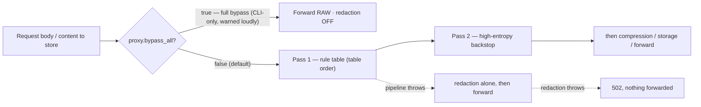

# Redaction Stage

Golem strips secrets/PII from traffic before anything is transformed, stored, or
forwarded (CLAUDE.md hard rule: redaction is never weakened or reordered). Two passes, always in this order:

1. **Rule table** — one auditable list, applied in table order (built-ins in
   `BUILT_IN_RULES`, `src/pipeline/redaction-rules.ts:104`; the exported
   `REDACTION_RULES` is a frozen copy, `:249`, so mutating it changes nothing —
   DUSTSEC.7): PEM private-key blocks first (so narrower rules can't shred their
   base64 body), then provider key shapes (most-specific-first, e.g. `sk-ant-`
   before generic `sk-`), then structured formats (JWT, connection-string
   passwords), then email PII (Luhn-gated credit-card numbers sit in the same
   band). The last built-in is **not** PII: `nostr-secret-key` (`nsec1...`, R14.3,
   `:225`) is appended after `email`. Plugin rules follow the built-ins
   (`activeRedactionRules()`, `:521`; see [[Plugin Seams]]). Order is part of the
   audit surface — see the file's top-of-file doc comment.
2. **High-entropy backstop** (`isHighEntropyToken`, `:413`) — catches uncontexted
   secrets the table missed. Candidates are unbroken base64/base64url-charset
   runs bounded to 32-128 chars (`ENTROPY_CANDIDATE_RE` /
   `ENTROPY_MAX_CANDIDATE_CHARS`, `:276-281`), scored by Shannon entropy against a
   4.2 bits/char threshold (`:289`). Three exclusions apply before the score
   (`:413-433`): integrity hashes (`sha512-...`), **pure-hex** tokens (dashes and
   underscores ignored: git SHAs, sha256 digests, UUIDs, Golem's own CCR
   `hash=<sha256>` markers), and tokens with **fewer than 2 of 3 character
   classes** (lowercase, uppercase, digit), plus path-like tokens (below).

## What "pure" and "idempotent" mean today

Neither claim is as strong as earlier revisions of this page said.

- **Not a pure function of the input alone.** The table is
  `activeRedactionRules()` = built-ins plus whatever plugin rules this process
  registered (`:521`). Plugin rules come from `plugins.load` config at startup,
  and a plugin `validate` callback is arbitrary code and can be impure
  (`src/plugins/loader.ts:248-257`). The built-in table has no clock, no
  randomness and no config, and the table is sealed for the life of the process
  once registered (`registerExtraRedactionRules`, `:483`), which is what keeps
  prompt-cache prefixes stable within a process.
- **Idempotent for most rules, not all.** Placeholders
  (bracketed, carrying a kind and an ordinal) use a charset most rules do not match, so
  re-redacting redacted text is normally a no-op. The exception is
  `connection-password`: its capture group `([^\s@/]+)` accepts `[`, `]` and `:`
  (`src/pipeline/redaction-rules.ts:195`), so it re-matches its own placeholder,
  and a second pass over a body with several connection-string passwords can
  renumber them. This is a **known bug** (DUST1.1 headline 6; audit item S10),
  left for Phase 3. Do not rely on idempotence or on a re-redacted prefix being
  stable for that rule. Plugin patterns are not constrained to avoid the
  placeholder charset either.

## Where it runs

Redaction is **stage 1 of the pipeline and is never reordered after compression**
(`src/pipeline/pipeline.ts:497-504`; it runs at every compression level). One
stage runs before it by design: join injection (stage 0.9, `pipeline.ts:449`),
and what it injects is then redacted by stage 1.

The single exception is `proxy.bypass_all`, a deliberate full bypass where
nothing runs. It is **not** a dial value: ADR-0004 gave it its own persisted
setting precisely so that no number could turn redaction off, and it is CLI-only,
never the default, and surfaced loudly wherever it is active — see
[[Compression Levels]] and [[Architecture]]. There is no other redaction-off
path:

- The per-request `x-golem-bypass` header and the `POST /__golem/pipeline/*`
  admin endpoint are **removed** (DUSTSEC.2); `#pipelineEnabled` is fixed from
  `bypass_all` at construction and never changed afterwards
  (`src/proxy/server.ts:109`).
- **A pipeline error does not forward the raw body.** On any throw in
  `pipeline.process`, the proxy re-runs redaction alone on the original request
  (`redactOnly`, `src/pipeline/pipeline.ts:383`) and forwards that; if redaction
  itself throws, or the pipeline has no `redactOnly`, it fails closed with a
  **502** and forwards nothing (`src/proxy/server.ts:329-353`; DUSTSEC.1, USER
  decision R1/S3). `redactOnly` leaves a body that is not a rewritable
  Messages JSON request unchanged, the same verdict `process` reaches.
- `bypass_all` is guarded against agents by a PreToolUse hook
  (`src/hooks/bypass-guard.ts`, DUSTSEC.3) that denies `golem off`,
  `golem config set` naming `proxy.bypass_all`, a truthy
  `GOLEM_PROXY_BYPASS_ALL` assignment and edits of `.golem` settings JSON that set
  it. This is a deny on the documented spellings, **not a sandbox**: an agent with
  arbitrary shell has process authority (the file's own header says so).

## Known false-positive classes (entropy backstop)

The backstop is heuristic and has needed successive narrowing, each logged in
`docs/plan/verification-notes.md`:

- **§31 — integrity hashes.** `sha512-<base64>` SRI/npm-lockfile `integrity`
  values are content hashes, not secrets, and saturate `package-lock.json`.
  Excluded via `INTEGRITY_HASH_RE` prefix check.
- **§37 — unbounded candidate length.** The original candidate regex had no
  ceiling, so large base64 blobs (images, minified assets) were wholesale
  redacted — lossy over-redaction that also inflated the savings metric.
  Fixed with the 128-char ceiling; a run longer than that isn't matched at
  all (the lookahead fails), so a blob is left completely intact rather than
  sliced.
- **§49 — path-like tokens.** The candidate charset includes `/`, `-`, `_`
  (needed because real base64/base64url secrets legitimately contain them),
  which let a whole repo path or a versioned/slugged filename with mixed
  case and digits (ADR names, dated filenames) form one candidate and clear
  the entropy threshold. Fixed by `isPathLikeToken`: split the candidate on
  `/-_` and require every resulting chunk to be purely alphabetic or purely
  numeric — the signature of a real path/slug. Real random secret material
  drawn from a 64-symbol alphabet is very unlikely to land every chunk
  entirely in one character class, so this doesn't reopen the door for
  actual secrets (proven by a regression case: a dash-delimited token whose
  chunks mix letters and digits still redacts).

Each fix is intentionally narrow rather than a blanket exclusion of the
triggering character, per the hard rule against weakening redaction — every
negative case added to guard a false positive is paired with a positive case
proving real secrets of that shape still redact
(`tests/unit/pipeline/redaction-audit.test.ts`).

## Open, not yet fixed

The credit-card rule's Luhn gate (`luhnValid`) allows unbounded
space/dash-separated digit runs before checking length — a long run of small
numbers separated by single spaces or dashes can coincidentally contain a
13-19-digit window that passes the Luhn checksum, producing a false
`[REDACTED:credit-card:n]` on non-card data. Discovered incidentally while
debugging visual tool-output redaction, not yet logged with a
verification-notes entry or scheduled.

See also [[Wiki-First Knowledge]].

---

## Resolved: credit-card separator-format guard (§50/§55, 2026-07-11)

The "Open, not yet fixed" credit-card item above is now fixed (R1.3). Adding
it to the **Known false-positive classes** list, in the same style as §31/§37/§49:

- **§50/§55 — credit-card Luhn-only gate.** The bare `luhnValid` check let any
  13-19 digit window through regardless of grouping, so a space-separated
  ASCII byte dump (irregular 1-3-digit groups) could pass Luhn by chance and
  get redacted as a card number. Fixed by `isCreditCardLike`
  (`luhnValid && hasConsistentSeparatorChar && hasUniformGrouping`):
  separators must be a single consistent character (all-space or all-dash,
  never mixed) AND every digit group between separators must be the same
  length. Consistent-separator-character alone would *not* have fixed the
  repro — an all-space, irregularly-grouped byte dump is already "consistent"
  under that narrower reading; uniform grouping is the check that actually
  defeats it. `luhnValid` itself is unchanged, still exported standalone.
  Regression cases (contiguous and 4-4-4-4-grouped Luhn-valid test cards)
  confirm real card shapes still redact
  (`tests/unit/pipeline/redaction-audit.test.ts`).

See also [[Wiki-First Knowledge]] and docs/plan/verification-notes.md §55.

---

## Resolved: provider-key rule gaps closed (§24/§56, 2026-07-11, R1.4)

Four provider secret shapes previously relied only on the entropy-sweep
backstop (which can miss short or low-entropy instances) and now have
dedicated `REDACTION_RULES` entries in `src/pipeline/redaction-rules.ts`:

- `google-api-key` — `AIza` prefix + 35 base64url-ish chars (39 chars total).
- `stripe-key` — `sk_live_` prefix (underscore, distinct from the existing
  `sk-` `openai-key` rule) + 24-99 alphanumeric chars.
- `gcp-oauth-token` — `ya29.` prefix + 20-120 base64url chars.
- `azure-account-key` — contextual, redacts only the `AccountKey=` value
  (base64, optional `=`/`==` padding) up to the next `;` or end of string,
  leaving `AccountName=`/`EndpointSuffix=` legible — same pattern as the
  existing `connection-password` rule.

Corpus cases for all four live in `tests/unit/pipeline/redaction.test.ts`'s
`CASES` array. This closes the specific provider list named in §24; other
providers' key shapes remain on the entropy-sweep backstop only, per §24's
original "add rules as needed" stance — not a claim of exhaustive coverage.

See [[R1.4 — provider-key redaction rule gaps closed (T-C3)]] and
docs/plan/verification-notes.md#§56.

---

## Resolved: path-with-embedded-UUID false positive (§140, 2026-08-22)

Extends the §49 fix rather than replacing it. §49 required every chunk of a
path-like candidate to be purely alphabetic or purely numeric; a UUID or hash
segment (mixed letters + digits) failed both, so an otherwise-clean path —
notably the session scratchpad path and `.claude/worktrees/agent-<id>/` —
still redacted whole.

- **§140 — hex chunks.** `isPathLikeToken` now also accepts a chunk that is
  pure hex (dehyphenated digits/`a-f`, either case), gated by
  `MIN_CHUNKS_FOR_HEX_ALLOWANCE = 3` chunks. Safe by call order, not just by
  the guard: `isHighEntropyToken` already excludes a token that is pure hex
  **in its entirety** before `isPathLikeToken` ever runs, so any token that
  reaches `isPathLikeToken` with a hex chunk must have at least one other
  chunk that is not hex-clean — a real word, or a mix with a non-`a-f`
  letter. A 2-chunk `word-hexlike` adversarial pair (one chunk short of the
  floor) still redacts, proving the guard is load-bearing and not merely
  decorative.

See [[Redaction Path Placeholders]] for the full write-up — the mechanism
(including why the `/` vs `\` separator spelling matters independently of
this fix), what to do when a path comes back as a placeholder, and the
reversible-vs-standalone placeholder asymmetry — and
docs/plan/verification-notes.md#§140 for the dated measurement (exit codes,
suite totals, end-to-end round-trip verification).
