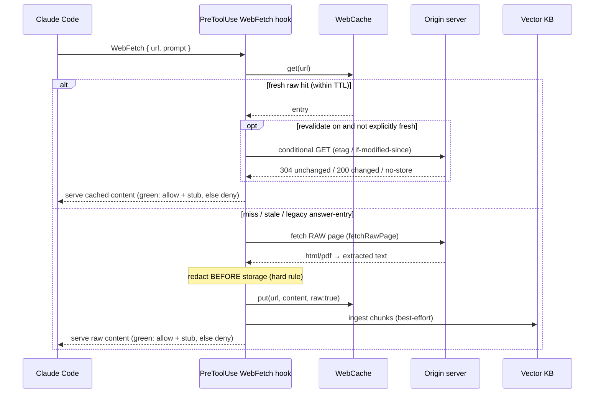
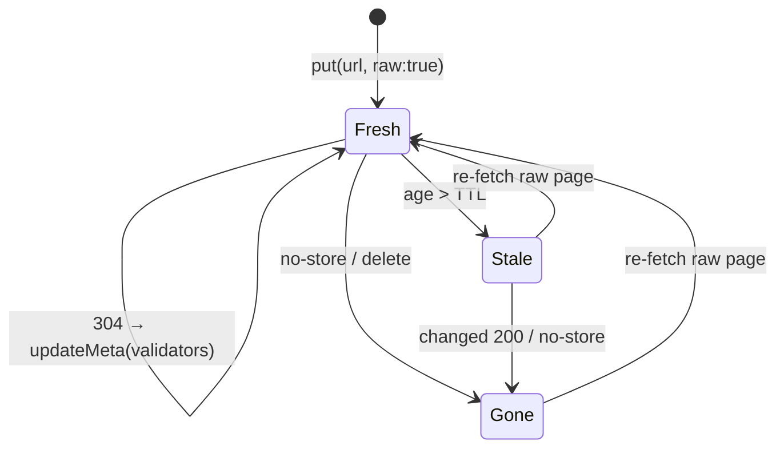

# Web Cache

How Golem serves a `WebFetch` from local cache instead of hitting the network — and
why the cached copy is the **raw page**, not `WebFetch`'s prompt-specific summary
(spec Decision 42). The cache is a tiny content-addressed store under
`<project>/.golem/webcache`, keyed by `sha256(url)`, that doubles as the freshness
clock over the same pages that get ingested into the vector [[Knowledge Base]].
Source: `src/hooks/web-fetch.ts`, `src/knowledge/web-cache.ts`.

## The fetch-cache-serve flow (PreToolUse)

On a `WebFetch`, a `PreToolUse` hook decides whether Golem answers from cache, or
fetches the raw page itself and serves that. On the deny floor `WebFetch` does not run;
on the green path (below) it does run, but against a loopback stub rather than the origin. Redaction runs **before** anything is stored (hard rule), and the
whole hook is **fail-open**: any error just lets `WebFetch` proceed.

- **Default TTL is 168h (7 days)** (`DEFAULT_WEB_CACHE_TTL_HOURS`); raw mode is on by
  default (`knowledge.webcache_fetch_raw`).
- **Oversized pages** (> ~8k chars served inline) are truncated for display but
  stored losslessly and handed back as a `hash=<id>` reference, retrievable in one
  step via the `expand` MCP tool — the same CCR mechanism described in
  [[Compression]].
- **PostToolUse** only matters in legacy (raw-mode-off) mode, where it caches
  `WebFetch`'s answer. In raw mode the pre-hook already owns caching, so the post
  hook deliberately caches nothing (storing a prompt-specific answer is exactly the
  bug Decision 42 fixes).

## A served page renders RED on the floor, GREEN on the shipped green path

The floor serve is a `deny` — the only `PreToolUse` shape that returns content without
running the tool — so Claude Code draws it as a **failed tool call**. The serve text
says so out loud: it opens `NOT AN ERROR —` and names the cause.

The green alternative **shipped** (R9.12, with the R9.19 reachability latch); the
2026-08-09 write-up that declined it (`debriefs/2026-08-09-R9.7-webfetch-red-dot.md`,
verification-notes §120) predates it. On the green path the hook answers `allow` with
`updatedInput` pointing `WebFetch` at a loopback stub, and carries the raw cached page in
`additionalContext` (`src/hooks/web-fetch/serve.ts:1-21,243-264`). It is chosen per call
by `greenServeState` (`serve.ts:130-165`), which fails closed to the deny floor unless
all four hold:

1. a loopback endpoint has published its coordinates (the proxy daemon is up);
2. the hook's `NODE_EXTRA_CA_CERTS` points at Golem's own certificate;
3. a TLS probe of the endpoint validates against that certificate;
4. R9.19: no evidence that an earlier rewrite in this window went unfollowed
   (`decideReach`, `src/proxy/loopback-reach.ts:180`; optimistic once per endpoint instance).

The stub, not the page, is what `WebFetch` fetches, so its summarizer never sees the
content (Decision 42 holds). Whether Claude Code still makes a summarizer call on the
stub, and what that costs: UNVERIFIED here.

## Freshness lifecycle

An entry is *fresh* while its age is under the TTL, and only then (`isFresh`,
`src/knowledge/web-cache.ts:56-61`, which ignores `expiresAt`). `Cache-Control: max-age`
and `Expires` are recorded as `expiresAt`, but they are read **only when conditional
revalidation is on** (`knowledge.webcache_revalidate`, default `false`,
`src/config/schema.ts:1160`): an entry whose `expiresAt` is still in the future skips the
conditional GET (`src/hooks/web-fetch.ts:374-380`). They never extend freshness past the
TTL. With revalidation on and no explicit window, a conditional GET (etag /
if-modified-since) confirms or refreshes the entry without re-downloading the body;
`no-store` or a changed `200` drops it (`web-fetch.ts:390-405`).

## Where this sits

The web cache is the **exact-URL index + freshness clock**; semantic recall over the
same fetched pages is the [[Knowledge Base]]'s job (they are ingested there too). A
re-fetch of a known URL is therefore free and offline for the cache half. The KB half
is best-effort: the hook ingests through its own process's `FileVectorDriver`
(`web-fetch.ts:195-211`), and a running MCP server does not reload the file and can
overwrite it on its next flush (`src/knowledge/file-driver.ts:153,218-232`), so the page
may be missing from `search` while one is up (audit D6, not fixed here). See [[Architecture]] for how
this fits the whole request path, and [[Redaction Stage]] for the redaction floor
every storage path shares.
